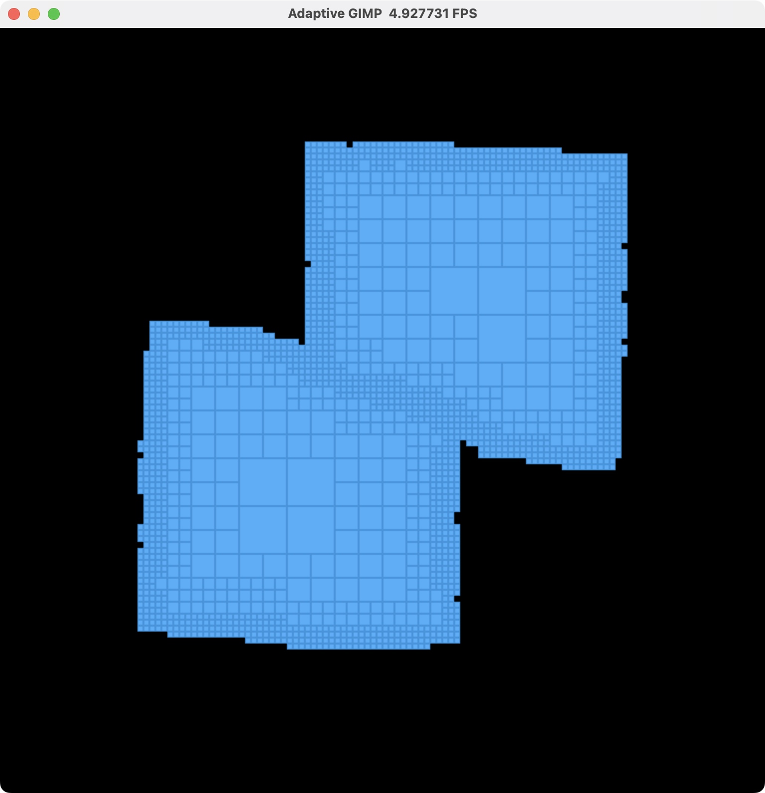
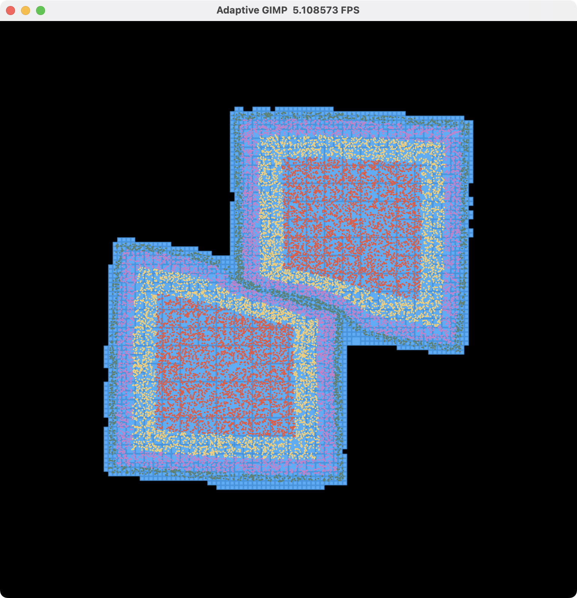
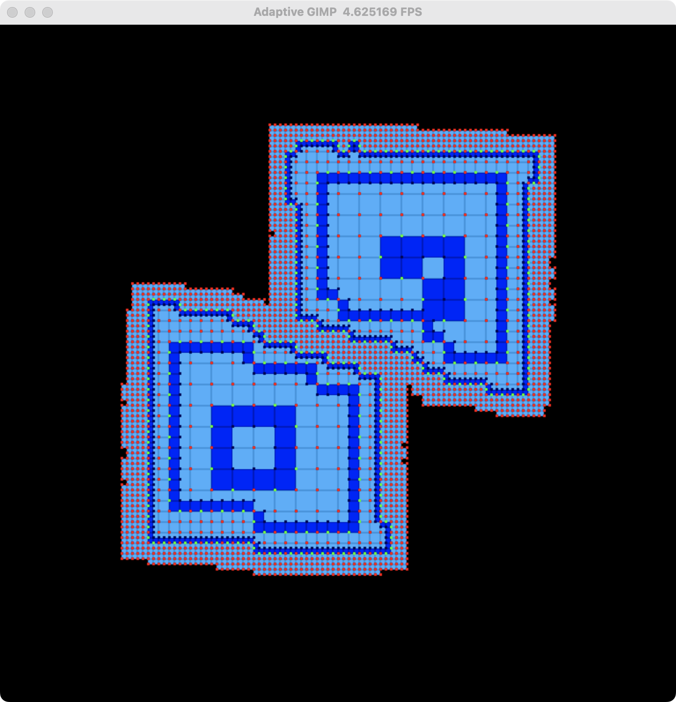
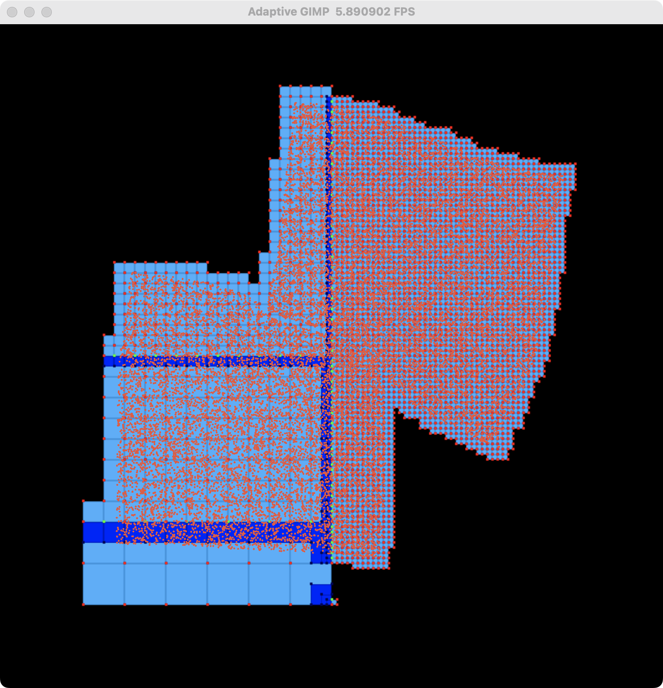
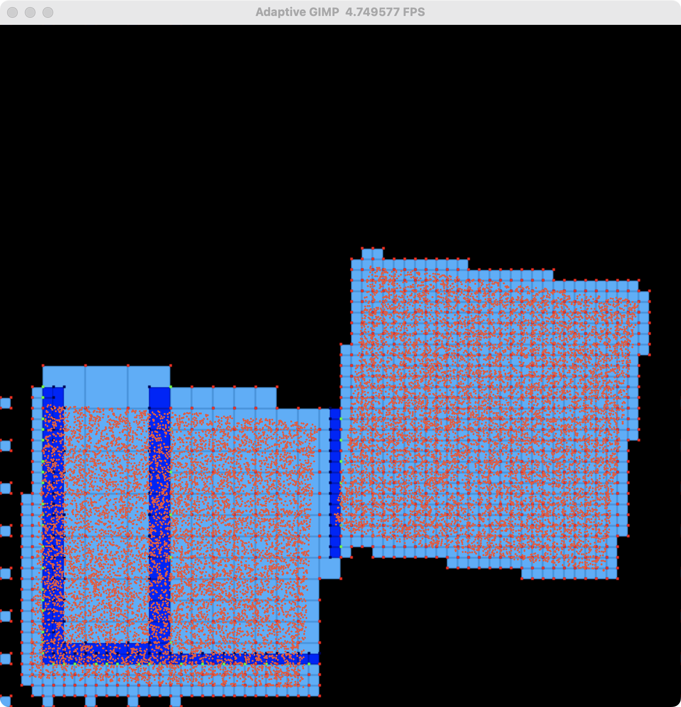
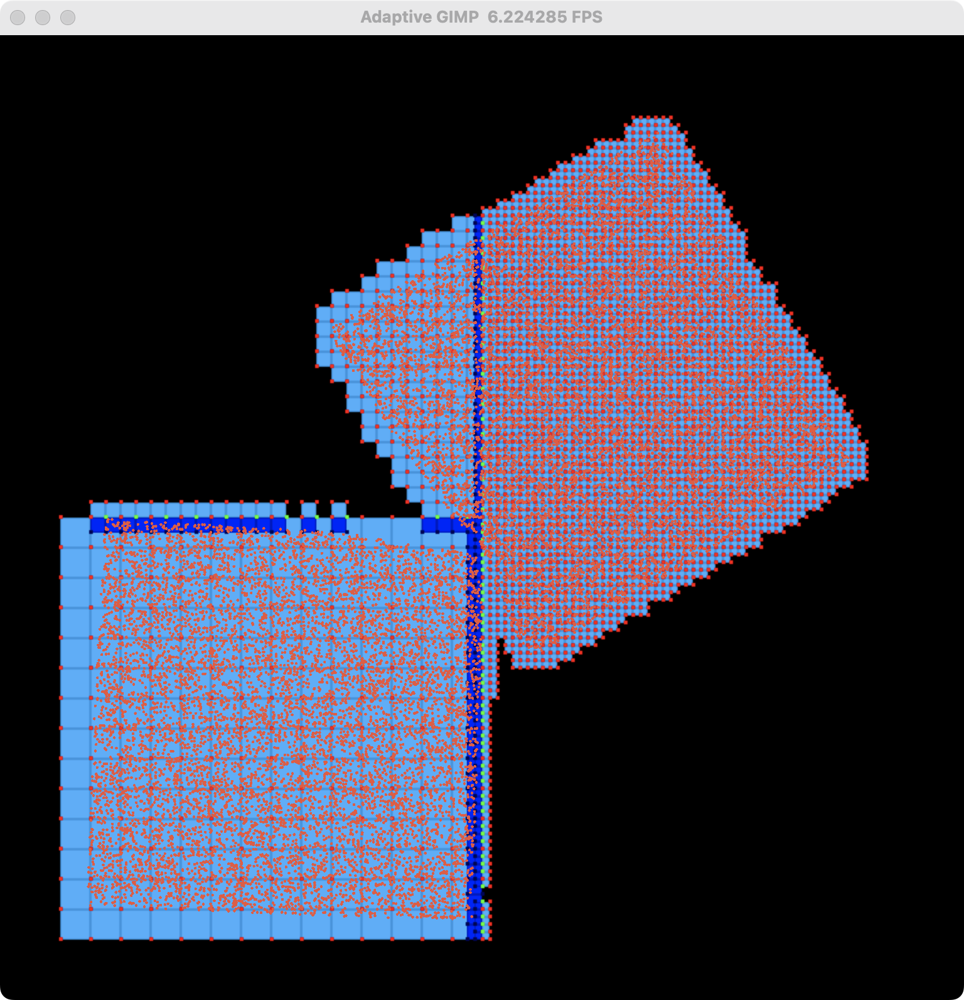
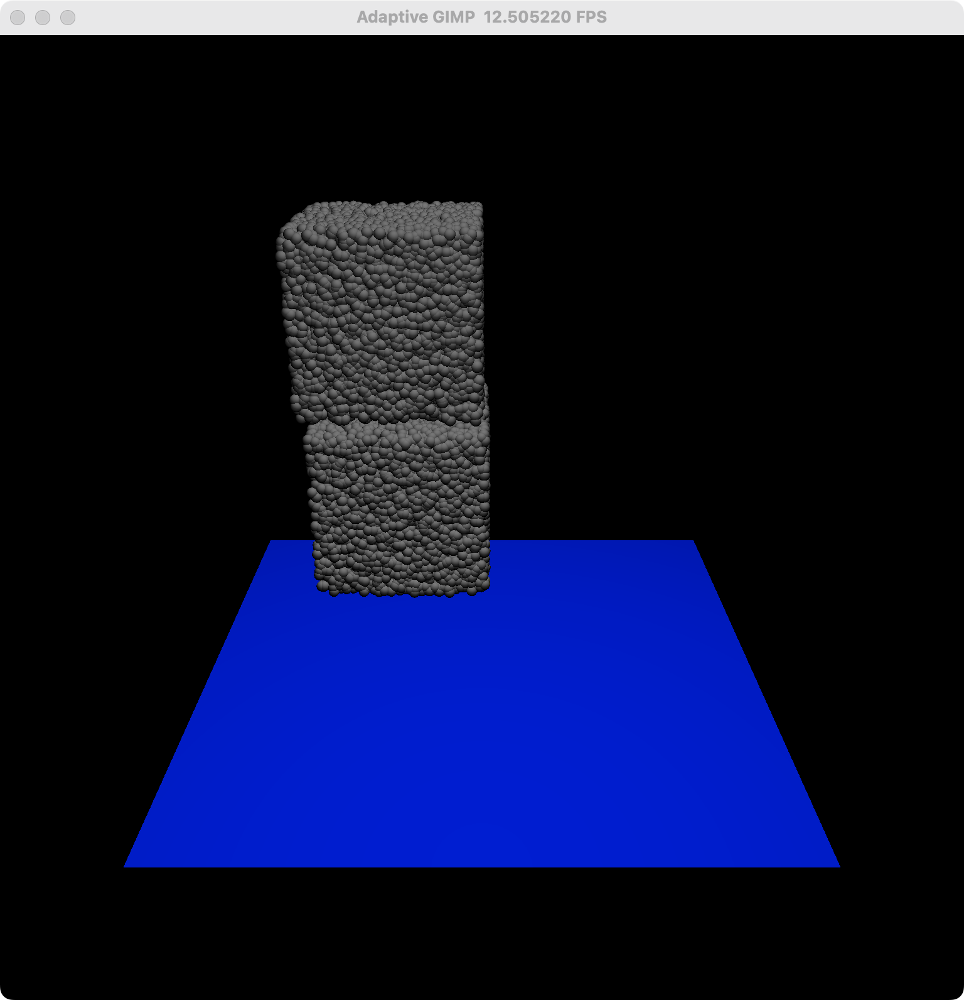
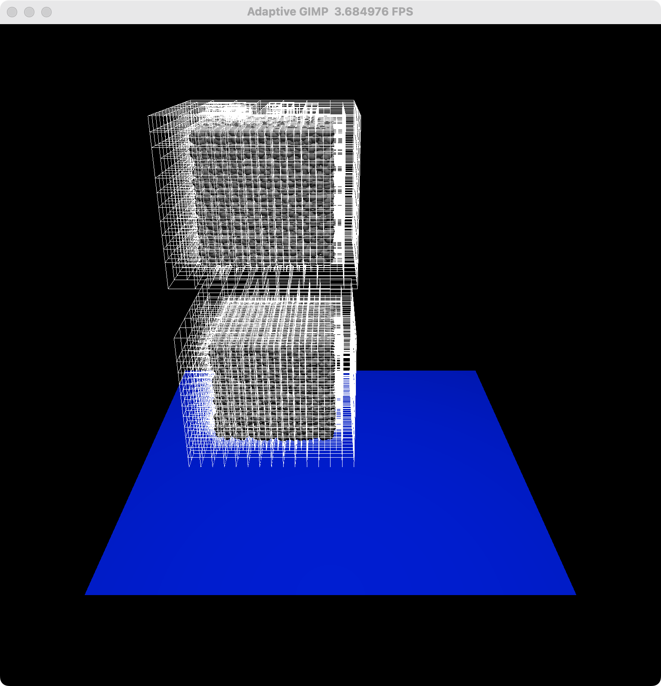

# Adaptive GIMP
Taichi Implementation of "An Adaptive Generalized Interpolation Material Point Method for Simulating Elastoplastic Materials"

Running the Demo
----------------

### 2D Demo with Dynamic Grid Adaptivity

```bash
python3 run.py --case 0
```

<a href="./imgs/dynamic-0.png"></a>
<a href="./imgs/dynamic-1.png"></a>
<a href="./imgs/dynamic-2.png"></a>

From left to right: adaptive grid (octree) visualization, particle visualization, ghost cell & T-junction node visualization.

### 2D Demo with Static Grid Adaptivity

```bash
python3 run.py --case [1-5]
```

<a href="./imgs/static-0.png"></a>
<a href="./imgs/static-1.png"></a>
<a href="./imgs/static-2.png"></a>

From left to right: different static grid refining strategies in different cases.

### 3D Demo

```bash
python3 run_3d.py
```

<a href="./imgs/3d-0.png"></a>
<a href="./imgs/3d-1.png"></a>

From left to right: particle visualization, grid visualization.

References
----------------

[1] Ming Gao, Andre Pradhana Tampubolon, Chenfanfu Jiang, and Eftychios Sifakis. 2017. An adaptive generalized interpolation material point method for simulating elastoplastic materials. ACM Trans. Graph. 36, 6, Article 223 (December 2017), 12 pages. https://doi.org/10.1145/3130800.3130879

[2] Rajsekhar Setaluri, Mridul Aanjaneya, Sean Bauer, and Eftychios Sifakis. 2014. SPGrid: a sparse paged grid structure applied to adaptive smoke simulation. ACM Trans. Graph. 33, 6, Article 205 (November 2014), 12 pages. https://doi.org/10.1145/2661229.2661269